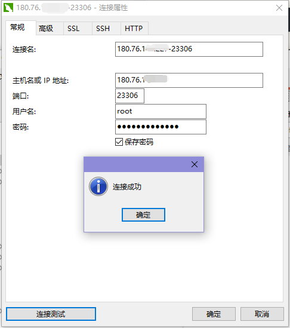

#<center>内网穿透搭建教程</center>

####一、使用proxy实现内网穿透

准备两台服务器：
```buildoutcfg
一台有固定IP的外网服务器，例如：180.76.123.37
一台内网环境的服务器，例如：192.168.1.137
```

安装命令及方法
安装最新proxy文件的命令，两台服务器均需要安装，命令如下：
备注：所有命令都需要使用root用户执行!!!

方式一：快速安装
```commandline
curl -L https://mirrors.host900.com/https://github.com/snail007/goproxy/blob/master/install_auto.sh | bash  
```
方式二：通过安装包安装

```editorconfig
安装包下载链接地址：https://github.com/snail007/goproxy/releases/tag/v10.7

  本次示例：安装包如下：
    proxy-linux-amd64.tar.gz

准备一台可访问外网的服务器先把install.sh文件下载下来，命令如下：
  wget https://mirrors.host900.com/https://raw.githubusercontent.com/snail007/goproxy/master/install.sh

将安装包及sh文件放置在同一目录下：
  cd /root/proxy/package/
    proxy-linux-amd64.tar.gz、install.sh
  
  执行命令：
    chmod +x install.sh
    ./install.sh

```
####实现思路

在外网服务器可访问到某个内网服务器的mysql数据。

例如：当用户想要访问内网数据库时，可通过【http://180.76.123.37:23306】方式连接，
此时，proxy可以将请求转发到【http://localhost:3306】即内网数据库连接。

####实现步骤：
1、外网服务器操作步骤：

1.1. 在外网服务器【180.76.123.37】上安装proxy
```commandline
su -
curl -L https://mirrors.host900.com/https://github.com/snail007/goproxy/blob/master/install_auto.sh | bash  
```
备注：可参考【 安装命令及方法】。

1.2. 在外网服务器【180.76.123.37】服务器上生成密钥
```buildoutcfg
cd /home/ghj/proxy/mysql/
proxy keygen -C proxy
```
1.3. 进入含有密钥的路径下新建窗口并执行命令，注意执行此命令的路径下需要有上一步生成的密钥
```commandline
cd /home/ghj/proxy/mysql/

 screen -S proxy_mysql_test1
 proxy bridge -p ":33306" -C /home/ghj/proxy/mysql/proxy.crt -K /home/ghj/proxy/mysql/proxy.key

 screen -S proxy_mysql_test2
 proxy server -r ":23306@:3306" -P "127.0.0.1:33306" -C /home/ghj/proxy/mysql/proxy.crt -K /home/ghj/proxy/mysql/proxy.key

 ctrl+a+d  挂到后台
```
####2、内网服务器操作步骤：
2.1. 在内网服务器【192.168.1.137】上安装proxy
```commandline
su -
curl -L https://mirrors.host900.com/https://github.com/snail007/goproxy/blob/master/install_auto.sh | bash  
```
备注：可参考【 安装命令及方法】。

2.2. 将在外网服务器【180.76.123.37】上生成密钥上传至内网服务器【192.168.1.137】的指定目录下
```commandline
cd /home/guanz/proxy/mysql/
scp -r root@180.76.123.37:/home/ghj/proxy/mysql/\{proxy.crt,proxy.key\} ./
```
2.3. 进入含有密钥的路径下新建窗口并执行命令，注意执行此命令的路径下需要有上一步生成的密钥
```commandline
cd /home/guanz/proxy/mysql/

screen -S mysql_demo1
proxy client -P "180.76.123.37:33306" -C /home/guanz/proxy/mysql/proxy.crt -K /home/guanz/proxy/mysql/proxy.key

ctrl+a+d  挂到后台
```
3、 启动本地服务器服务
```commandline
systemctl restart mysql
```
4、 测试是否可以连接




